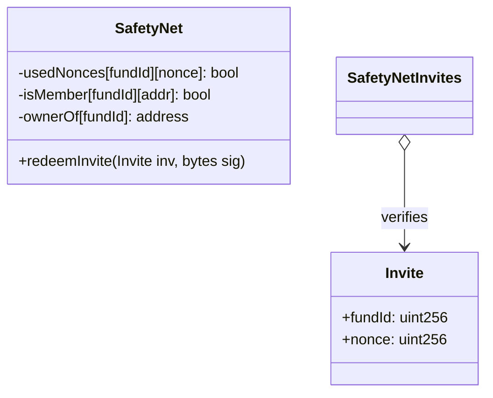
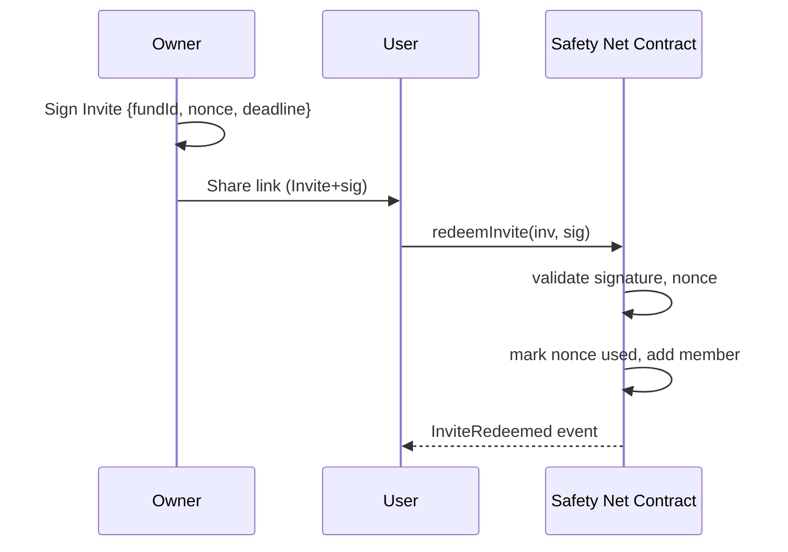
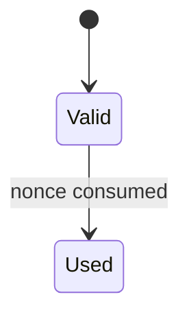

---

# Technical Spec – Safety Net Invite 

---

## 1. Background

**Problem Statement:**
Today, when creating a Safety Net (SafetyNet), all members must be declared upfront. This makes progressive onboarding difficult and slows down organizers. The first design with on-chain stored invites exposed them publicly. A later proposal with counters and Merkle roots was too complex for the core use case.

**Context / History:**

* [SafetyNets repository](https://github.com/BreadchainCoop/safety_net)
* Discussion of on-chain invites → discoverability problem.
* Discussion of counters / Merkle roots → overengineered for MVP.

**Stakeholders:**

* Safety Net creators / owners.
* Prospective members invited to join.
* Bread maintainers.
* Frontend / UI developers.

---

## 2. Motivation

**Goals & Success Stories:**

* Safety Net owner generates an **off-chain signed invite**.
* Invite is shared as a link or QR code.
* Anyone holding the invite can redeem it once to join.
* Each invite is **single-use** via a `nonce`.
* Nothing is exposed on-chain until redemption.

---

## 3. Scope and Approaches

**Non-Goals:**

| Technical Functionality   | Reasoning for being off scope           | Tradeoffs                             |
| ------------------------- | --------------------------------------- | ------------------------------------- |
| Multi-use invites         | Simpler MVP: one signature = one invite | Cannot share one link with many users |
| Allowlist / Merkle root   | Overkill for current goals              | Useful for enterprise, not needed now |
| Global counter revocation | Not required for MVP                    | Cannot invalidate all invites at once |

---

**Value Proposition:**

| Technical Functionality | Value                                | Tradeoffs                        |
| ----------------------- | ------------------------------------ | -------------------------------- |
| EIP-712 signed invites  | Private, non-discoverable on-chain   | Requires off-chain signing       |
| Nonce (one-time use)    | Prevents replay and double use       | Storage required per invite      |

---

**Alternative Approaches:**

| Approach                | Pros                             | Cons                                  |
| ----------------------- | -------------------------------- | ------------------------------------- |
| On-chain stored invites | Easy to track, transparent state | Publicly visible, like open join      |

---

**Relevant Metrics:**

* Invite redemption success rate.
* Number of invites consumed vs. issued.
* Common failure cases (expired, already used, bad signature).

---

## 4. Step-by-Step Flow

### 4.1 Main (“Happy”) Path

* **Pre-condition:** Safety Net exists and has a defined owner.
* **Actor:** Owner generates `(fundId, nonce, deadline)` and signs with EIP-712.
* **System validates:**

  * Nonce not used.
  * Signature matches fund owner.
* **System persists / computes:**

  * Marks nonce as used.
  * Adds `msg.sender` as member.
  * Emits `InviteRedeemed`.
* **Post-condition:** User becomes a member of the Safety Net.

### 4.2 Alternate / Error Paths

| #  | Condition           | System Action           | 
| -- | ------------------- | ----------------------- | 
| A1 | Invite already used | `revert Invite used`    | 
| A2 | Invite expired      | `revert Invite expired` | 
| A3 | Invalid signer      | `revert Invalid signer` | 
| A4 | User already member | `revert Already member` | 

---

## 5. UML Diagrams

### Class Diagram

### Sequence Diagram

### State Diagram

---

## 5. Edge cases and concessions

* **Single-use only:** each invite works once, then becomes invalid.
* **No global invalidation:** leaked invites remain valid until used or expired.

---

## 6. Open Questions

* Should fund owners be able to **invalidate unused invites** (e.g. via counter like @bagelface said) in the MVP?

---

## 7. Glossary / References

* **Invite:** EIP-712 signature over `(fundId, nonce, deadline)`.
* **Nonce:** Unique value ensuring invite is one-time use.
* **Deadline:** Expiry timestamp for the invite.
* **Safety Net / SafetyNet:** Mutual aid group with periodic contributions.

**Links:**

* [Safety Nets repo](https://github.com/BreadchainCoop/safety-net)
* [EIP-712 specification](https://eips.ethereum.org/EIPS/eip-712)

---
