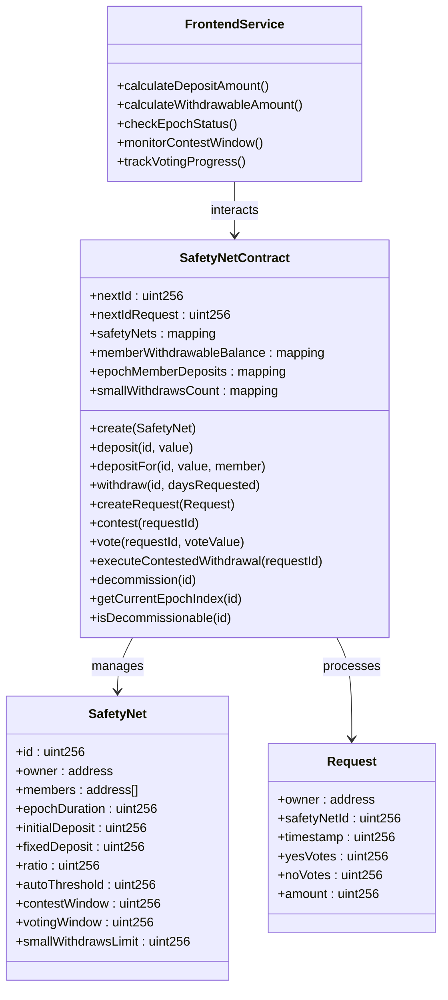
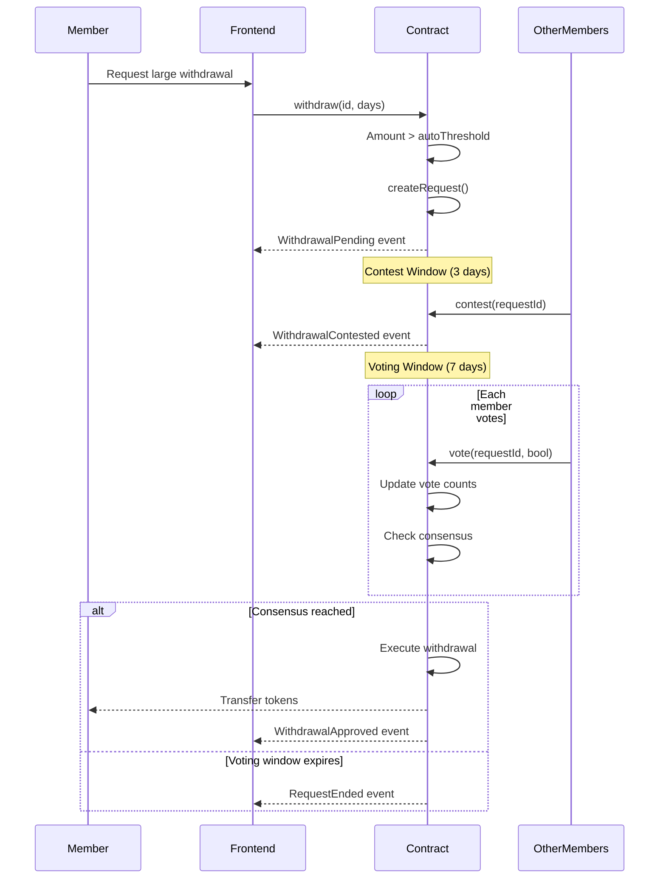
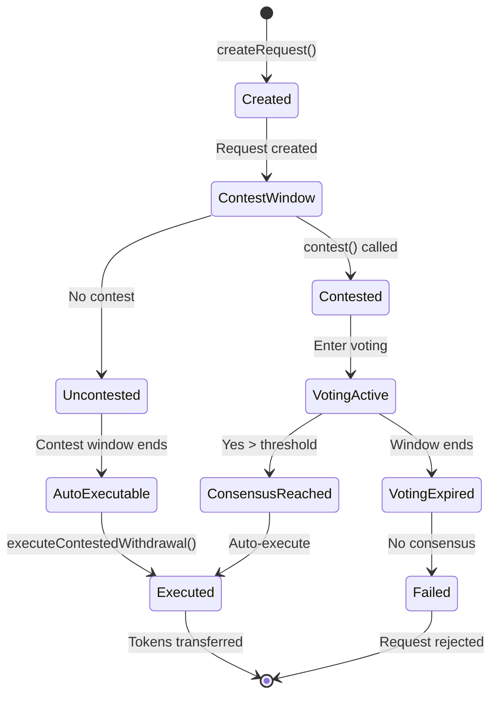
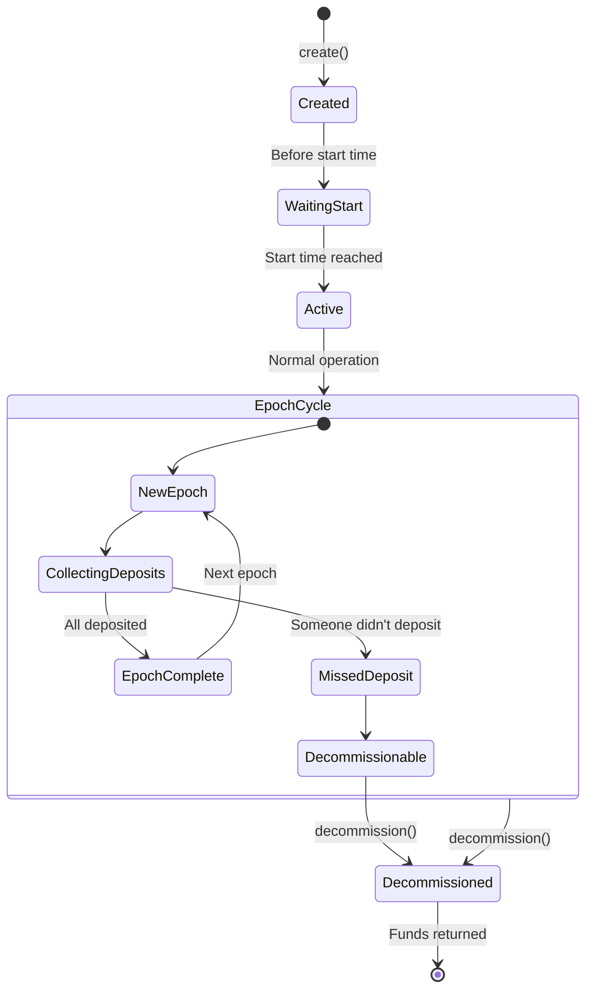

# Technical Spec: SafetyNet Frontend Application

## 1. Background

### Problem Statement
SafetyNet (formerly BreadFunds) is a decentralized mutual aid and collective savings protocol that enables groups to pool resources for emergencies. The contract implements a sophisticated system with epochs, withdrawal ratios, voting mechanisms, and automatic/contested withdrawals. Currently lacks a user interface to interact with these complex features, making it inaccessible to non-technical users.

### Context / History
- Originally named BreadFunds, rebranded to SafetyNet (#47)
- Built on Solidity with Foundry framework and OpenZeppelin contracts
- Implements epoch-based contribution tracking to enforce regular deposits
- Features a configurable `ratio` parameter (currently locked to 1 for v1 due to liquidity risks #25)
- Supports small automatic withdrawals and large contested withdrawals with voting
- Key issues identified:
  - Liquidity risk when ratio > 1 (#22, #26, #27)
  - Missing withdrawal balance deduction on large requests (#38)
  - Security vulnerabilities in request creation (#37)
  - First deposit permanently fixes daily withdrawal cap (#40)

### Stakeholders
- **Safety Net Members**: Users who join groups and make regular epoch-based deposits
- **Safety Net Creators/Owners**: Users who configure and launch new safety nets
- **Request Creators**: Members requesting withdrawals for emergencies
- **Voters**: Members voting on contested withdrawal requests
- **External Systems**: 
  - ERC20 token contracts (whitelisted tokens only)
  - Ethereum-compatible blockchains (Gnosis, Optimism, Sepolia)
  - Web3 wallet providers (MetaMask, WalletConnect, etc.)
- **Development Team**: Frontend developers, smart contract developers, UX designers, security auditors

## 2. Motivation

### Goals & Success Stories

**User Goals:**
- **Safety Net Creation**: Configure all parameters (members, epochs, ratios, thresholds) with clear explanations
- **Epoch Management**: Track current epoch, see who has/hasn't deposited, understand decommission risk
- **Deposit Flows**: Make initial deposit with setup fee, regular epoch deposits, or deposit for another member
- **Small Withdrawals**: Request automatic withdrawals under threshold (limited per epoch)
- **Large Withdrawals**: Create withdrawal requests that trigger voting process
- **Contest & Voting**: Contest suspicious requests, vote on contested requests, track consensus
- **Auto-execution**: Monitor and execute uncontested requests after contest window
- **Decommission**: Identify when safety nets can be decommissioned due to missed deposits
- **Balance Tracking**: View withdrawable balance (considers ratio), contribution history, and actual pool balance

**Technical Functionality:**
- Display epoch countdown timers and deposit deadlines
- Calculate and show required deposit amounts (initial + fixed + contribution)
- Track voting windows and contest periods in real-time
- Show consensus progress on withdrawal requests
- Alert users to decommission conditions
- Handle ratio calculations correctly (locked to 1 for v1)

## 3. Scope and Approaches

### Non-Goals

| Technical Functionality | Reasoning for being off scope |
|------------------------|-------------------------------|
| Ratio > 1 configurations | Disabled in v1 due to liquidity risks (#25, #26) |
| Automated deposit collection | No allowance-based auto-deposits yet (#32) |
| Member invitation system | All members must be specified at creation (#42) |
| Withdrawal notifications | No backend infrastructure for notifications (#24) |
| Risk ratio formulas | Context-aware ratio calculation deferred to v2 (#29) |
| Prime-based crediting | Actuarial model deferred to v2 (#31) |
| Liquidity-aware epoch ratios | Dynamic ratio adjustment deferred to v2 (#30) |
| Fiat on/off ramps | Regulatory complexity |
| Cross-chain bridges | Added complexity |

### Value Proposition

| Technical Functionality | Value | Tradeoffs |
|------------------------|-------|-----------|
| Epoch-based tracking | Ensures regular contributions | Complex time calculations |
| Small withdrawal limits | Quick access to funds | Limited withdrawals per epoch |
| Contest windows | Fraud prevention | Delays large withdrawals |
| Voting mechanism | Democratic control | Requires member participation |
| Decommission detection | Protects active members | May trigger unexpectedly |
| Fixed ratio = 1 | Prevents insolvency | Limits insurance use cases |
| Member list immutable | Simpler implementation | No flexibility for growth |
| No email notifications | Privacy, no backend needed | Users must check manually |
| Whitelisted tokens only | Security and stability | Limited token options |

### Alternative Approaches Considered

| Technical Functionality | Pros | Cons |
|------------------------|------|------|
| Backend-driven draft funds (#42) | Flexible member addition | Centralization, complexity |
| On-chain invite system (#42) | Decentralized invites | Gas costs, signature management |
| Automated allowance deposits (#32) | No manual deposits needed | Security risks, complex UX |
| Push notifications (#24) | Better user awareness | Requires backend infrastructure |
| Dynamic ratio adjustment | Responsive to liquidity | Complex, potential for gaming |

### Relevant Metrics
- Epoch deposit compliance rate (target: > 90%)
- Contest-to-vote conversion rate (target: > 80%)
- Small withdrawal success rate (target: 100%)
- Voting participation rate (target: > 60%)
- Decommission prevention rate (target: > 95%)
- Request auto-execution success (target: 100%)
- Gas optimization per transaction type
- Time from request to withdrawal completion

## 4. Step-by-Step Flow

### 4.1 Main ("Happy") Paths

**1. Create Safety Net Flow:**
- **Pre-condition**: Owner has whitelisted token balance, token is allowed by protocol
- Owner navigates to create page
- Owner configures parameters:
  - Member addresses (minimum 2, no duplicates)
  - Minimum/maximum members
  - Consensus threshold percentage
  - Initial deposit (one-time setup fee)
  - Fixed deposit (per-epoch fee)
  - Contribution amount (member's regular deposit)
  - Ratio (locked to 1 in v1)
  - Auto-threshold (small withdrawal limit)
  - Contest window duration
  - Voting window duration
  - Epoch duration
  - Small withdrawals limit per epoch
  - Safety net start timestamp
- System validates no duplicate members (#36)
- System confirms ratio = 1 (#25)
- Owner approves and submits transaction
- **Post-condition**: Safety net created, members registered, awaiting first epoch

**2. Make Epoch Deposit Flow:**
- **Pre-condition**: Member of safety net, current epoch started, hasn't deposited this epoch
- Member views safety net dashboard showing epoch countdown
- System calculates deposit amount:
  - First deposit: contribution + fixed + initial
  - Regular: contribution + fixed
- Member approves token transfer
- System records epoch deposit, updates withdrawable balance (contribution * ratio)
- **Post-condition**: Member marked as deposited for epoch, withdrawable balance increased

**3. Deposit For Another Member Flow:**
- **Pre-condition**: Payer wants to help another member make their deposit
- Payer navigates to safety net details
- Payer selects member to deposit for
- System calculates required deposit for that member
- Payer approves token transfer
- System credits deposit to target member
- **Post-condition**: Target member marked as deposited, their withdrawable balance increased

**4. Small Withdrawal Flow (Automatic):**
- **Pre-condition**: Member has withdrawable balance, within small withdrawal limit for epoch
- Member specifies days of withdrawal (1-30)
- System calculates: daily_amount = (monthly_contribution * ratio) / 30
- System checks: withdrawal_amount = daily_amount * days <= auto_threshold
- System checks: small_withdrawals_count < limit for epoch
- Tokens transferred immediately
- **Post-condition**: Withdrawable balance reduced, small withdrawal count incremented

**5. Large Withdrawal Request Flow:**
- **Pre-condition**: Member needs amount > auto_threshold
- Member creates withdrawal request for X days
- System creates request with timestamp
- Contest window begins (e.g., 3 days)
- If not contested:
  - After contest window, anyone can call executeContestedWithdrawal
  - Tokens transferred to requester
- **Post-condition**: Request executed or enters voting

**6. Contest and Voting Flow:**
- **Pre-condition**: Request created, within contest window
- Any member contests the request
- Voting window begins (e.g., 7 days)
- Members cast yes/no votes
- If yes votes > members * consensus_threshold / 100:
  - Immediate execution and transfer
- If voting window expires without consensus:
  - Request fails
- **Post-condition**: Request approved/rejected based on votes

**7. Decommission Flow:**
- **Pre-condition**: Member missed deposit in any past epoch
- Anyone calls decommission function
- System validates at least one member missed an epoch deposit
- All remaining balances distributed:
  - Withdrawable balances returned to respective members
  - Remaining pool balance split equally
- **Post-condition**: Safety net deleted, all funds returned

### 4.2 Alternate / Error Paths

| # | Condition | System Action | Suggested Handling |
|---|-----------|---------------|-------------------|
| A1 | Token not whitelisted | Revert with TokenNotAllowed | Show allowed tokens list |
| A2 | Duplicate members in creation | Revert with DuplicateMember | Highlight duplicate addresses |
| A3 | Already deposited this epoch | Revert with AlreadyDeposited | Show deposit status, next epoch time |
| A4 | Deposit before safety net start | Revert with DepositBeforeSafetyNetStart | Show countdown to start time |
| A5 | Invalid deposit amount (≤0) | Revert with InvalidDepositAmount | Show required amounts |
| A6 | Exceeds small withdrawal limit | Revert with ExceedsSmallWithdrawalLimit | Suggest large withdrawal request |
| A7 | Not enough withdrawable balance | Revert with NotWithdrawable | Show available balance |
| A8 | Already voted on request | Revert with AlreadyVoted | Show vote already cast |
| A9 | Contest window closed | Revert with ContestWindowClosed | Show window expired |
| A10 | Voting window closed | Revert with VotingWindowClosed | Show voting results |
| A11 | Request already executed | Revert with AlreadyExecuted | Show execution status |
| A12 | Not member of safety net | Revert with NotMember | Show membership required |
| A13 | Safety net decommissioned | Revert with NotCommissioned | Show decommission status |
| A14 | Minimum members < 2 | Revert with InvalidMinimumMembers | Require at least 2 members |
| A15 | Ratio != 1 (v1 restriction) | Revert with InvalidRatio | Explain ratio locked to 1 |
| A16 | ERC20 transfer fails | Revert with TransferFailed | Check token balance/approval |

## 5. UML Diagrams

### Class Diagram

### Sequence Diagram - Contested Withdrawal Flow

### State Diagram - Request Lifecycle

### State Diagram - Safety Net Lifecycle

## 5. Edge Cases and Concessions

### Critical Issues to Address in Frontend
- **Issue #38**: Large withdrawal execution doesn't deduct from withdrawable balance
  - Frontend must track this separately until contract is fixed
  - Show warning about potential insolvency
- **Issue #37**: Anyone can create withdrawal requests (not just members)
  - Frontend must validate membership before showing request UI
  - Filter out invalid requests in display
- **Issue #40**: First deposit permanently fixes daily withdrawal cap
  - UI must clearly explain this limitation
  - Show permanent daily cap after first deposit
- **Issue #36**: Duplicate members can be added
  - Frontend must validate no duplicates before submission

### Known Limitations (V1)
- **Ratio locked to 1**: Cannot configure insurance multipliers (#25)
- **No member additions**: All members fixed at creation (#42)
- **No notifications**: Users must manually check request status (#24)
- **Manual deposits only**: No auto-collection via allowances (#32)
- **No liquidity awareness**: Ratio doesn't adjust to pool health (#30)

### Frontend Workarounds
- Calculate and display "true" withdrawable balance considering executed requests
- Show decommission risk indicators based on deposit history
- Implement local notification system for time-sensitive actions
- Provide epoch countdown timers and deposit reminders
- Validate all inputs client-side to prevent failed transactions

## 6. Open Questions

1. **Epoch Timer Display**: How to handle timezone differences and DST for epoch countdowns?
2. **Deposit Reminder System**: Should we implement browser notifications for upcoming epochs?
3. **Request Monitoring**: Should auto-execution of uncontested requests be automated in frontend?
4. **Voting Interface**: Show real-time vote counts or hide until voting ends?
5. **Decommission Warning**: How aggressively to warn about missed deposits?
6. **Gas Estimation**: Show gas in USD or native token only?
7. **Historical Data**: How many epochs of history to display?
8. **Member Dashboard**: Individual view vs. collective view as default?
9. **Mobile UX**: Separate mobile UI or responsive design for complex voting interface?
10. **Error Recovery**: How to handle partial state updates on transaction failures?
11. **Configuration Wizard**: Guided setup vs. advanced form for safety net creation?
12. **Withdrawal Calculator**: Show all withdrawal options with outcomes?
13. **Contract Migration**: How to handle frontend when contract is upgraded?
14. **Request Filtering**: Show all requests or filter by status/member?
15. **Batch Operations**: Allow multiple deposits in one transaction?

## 7. Glossary / References

**Contract Terms:**
- **Safety Net** -- Collective savings group with enforced regular deposits and voting mechanisms
- **Epoch** -- Fixed time period (e.g., 30 days) during which members must make deposits
- **Initial Deposit** -- One-time setup fee paid on first deposit to join safety net
- **Fixed Deposit** -- Per-epoch fee that goes to the collective pool (not withdrawable)
- **Contribution** -- Member's regular deposit amount that becomes withdrawable (multiplied by ratio)
- **Ratio** -- Multiplier for withdrawable balance (locked to 1 in v1 to prevent insolvency)
- **Auto-threshold** -- Maximum amount for automatic small withdrawals without voting
- **Small Withdrawals Limit** -- Maximum number of small withdrawals per member per epoch
- **Contest Window** -- Time period (e.g., 3 days) when members can challenge a withdrawal request
- **Voting Window** -- Time period (e.g., 7 days) for voting on contested requests
- **Consensus Threshold** -- Percentage of yes votes needed to approve contested withdrawal
- **Withdrawable Balance** -- Amount member can withdraw (contribution * ratio - withdrawn)
- **Daily Withdrawal Rate** -- (monthly_contribution * ratio) / 30 days
- **Decommission** -- Forced closure of safety net when any member misses an epoch deposit

**Technical References:**
- [Issue #22: Liquidity Risk from Ratio > 1](https://github.com/BreadchainCoop/breadfunds/issues/22)
- [Issue #25: Lock Ratio to 1](https://github.com/BreadchainCoop/breadfunds/issues/25)
- [Issue #37: Request Creation Vulnerability](https://github.com/BreadchainCoop/breadfunds/issues/37)
- [Issue #38: Missing Balance Deduction](https://github.com/BreadchainCoop/breadfunds/issues/38)
- [Issue #40: First Deposit Cap Issue](https://github.com/BreadchainCoop/breadfunds/issues/40)
- [Issue #42: Flexible Member Addition](https://github.com/BreadchainCoop/breadfunds/issues/42)
- [SafetyNet Contract Source](https://github.com/BreadchainCoop/breadfunds/blob/main/src/contracts/SafetyNet.sol)
- [SafetyNet Interface](https://github.com/BreadchainCoop/breadfunds/blob/main/src/interfaces/ISafetyNet.sol)